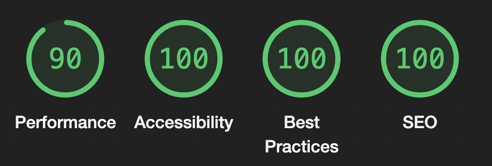

# Miammy

Miammy is a food recipe app, targeting anyone who wants to cook and discover new meal recipes.


## Main Technologies


Miammy also relies on a 3rd party API called theMealDB https://www.themealdb.com/api.php

## Usage
Fork the repo

Clone it locally:
**```git clone https://github.com/your_username_/Miammy.git```**

Install the dependencies
**```npm install```**

Run webpack
**```npm run build:dev```**

Run the server
**```npm run server:dev```**

Open the application on the browser at **[localhost:3000](http://localhost:3000/)**

Have fun 🤩

## Performance


## 🔥 Coming next
Firebase authentication --> ongoing
Responsiveness
Performance testing
Unit testing
